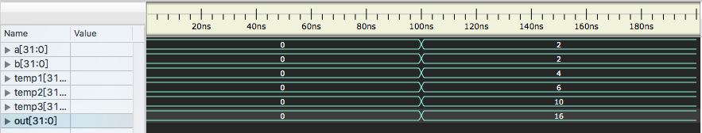
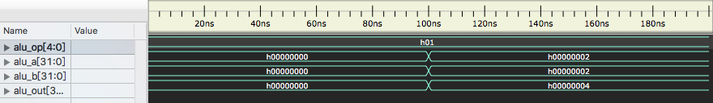
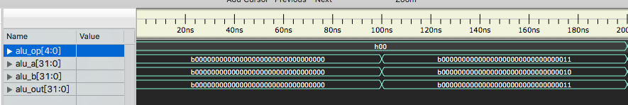
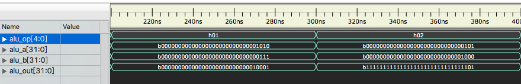
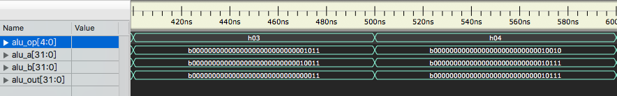
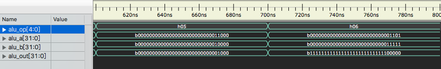

# lab01 ALU

### 张立夫 PB15020718

## 实验目的

设计一算数运算单元 ALU

- 采用纯组合逻辑设计
- 32bit 位宽
- 完成指定运算功能

ALU 对外提供以下接口：

- 输入：32 位有符号运算数 alu_a
- 输入：32 位有符号运算数 alu_b
- 输入：5 位操作数 alu_op
- 输出：32 位运算结果 alu_out

## 实验平台

- 操作系统：MacOS X
- 编译器：Icarus Verilog version 10.2
- 仿真波形查看：Scansion

## 实验要求

1. ALU 实现以下 7 种操作：

   空运算，符号加，符号减，与，或，异或，或非

2. 使用模块调用完成以下运算

   - 斐波拉契数列
     - 2，2，4，6，10，16
   - 输入为 a，b，其中 a = 2，b = 2
   - 调用 ALU 完成：
     - 输入为 a = b = 2，输出为 16
     - 需要定义一个顶层模块，模块内调用 ALU 模块 N 次

## 实验过程

1. 创建 ALU 文件 `alu.v`
   - 采用 `case` 语句，对输入的操作数 alu_op 进行判断，进行不同的运算，赋值给 alu_out 进行输出。
2. 创建顶层文件 `top.v`
   - 提供输入：a，b，输出：out
   - 为达到输出 16，需调用 ALU 模块 4 次，故创建 `wire` 类型变量 `[31:0] temp1, temp2, temp3` ，操作数均输入常数 1 （符号加运算）
3. 创建测试文件 `test.v`
   - 设置生成仿真波形文件：`$dumpfile("test.vcd");$dumpvars;`
   - 初始化 a = 0; b = 0; 100ns 后 a = 2; b = 2
4. 创建测试文件 `test_alu.v` 
   - 设置 7 组初始值，对 ALU 的 7 个功能进行测试
   - 每组测试操作数为该组对应数值
5. 编译运行

```shell
# 测试斐波拉契
iverilog -o test.vvp test.v
vvp test.vvp
open -a Scansion test.vcd
```

```shell
# 测试7种运算
iverilog -o test_alu.vvp test_alu.v
vvp test_alu.vvp
open -a Scansion test_alu.vcd
```

## 实验结果

### 1. 进行斐波拉契数列运算

`top.v` 仿真结果：



数据解释：

- temp1-3：调用一到三次 ALU 模块输出结果
- out：调用四次 ALU 模块后的输出结果

`alu.v` 仿真结果：



第一次调用 ALU 模块时其中变量数据

### 2. 对 7 种运算进行测试

1. 初始化，空运算(alu_op = 0)

   

2. 符号加(alu_op = 1)，符号减(alu_op = 2)

   

3. 与(alu_op = 3)，或(alu_op = 4)

   

4. 异或(alu_op = 5)，或非(alu_op = 6)

   

## 实验总结

本次实验比较基础，实现的 ALU 模块在之后的实验中会有多次使用，在本次实验过程中主要对新的实验环境（iverilog + Scansion）进行了熟悉。

## 附录

### 源代码：

`top.v` :

```verilog
`timescale 1ns / 1ps
`include "alu.v"

module top(
  input signed  [31:0] a,
  input signed  [31:0] b,
  output        [31:0] out
);

wire [31:0] temp1, temp2, temp3;

alu alu1(a, b, 5'h1, temp1);
alu alu2(b, temp1, 5'h1, temp2);
alu alu3(temp1, temp2, 5'h1, temp3);
alu alu4(temp2, temp3, 5'h1, out);

endmodule
```

`alu.v` :

```verilog
`timescale 1ns / 1ps

module alu(
    input signed [31:0] alu_a,
    input signed [31:0] alu_b,
    input        [4:0]  alu_op,
    output reg signed  [31:0] alu_out
);

parameter A_NOP = 5'h00;  //空运算
parameter	A_ADD = 5'h01;	//符号加
parameter	A_SUB = 5'h02;	//符号减
parameter	A_AND = 5'h03;	//与
parameter	A_OR = 5'h04;	  //或
parameter	A_XOR = 5'h05;	//异或
parameter	A_NOR = 5'h06;	//或非

always@(*) begin
  case (alu_op)
    A_NOP: alu_out = alu_a;
    A_ADD: alu_out = alu_a + alu_b;
    A_SUB: alu_out = alu_a - alu_b;
    A_AND: alu_out = alu_a & alu_b;
    A_OR: alu_out = alu_a | alu_b;
    A_XOR: alu_out = alu_a ^ alu_b;
    A_NOR: alu_out = ~(alu_a | alu_b);
    default: alu_out = alu_a;
  endcase
end

endmodule
```

`test.v` :

```verilog
`timescale 1ns / 1ps
`include "top.v"

module test;
    reg [31:0] a;
    reg [31:0] b;
    wire [31:0] out;
    top uut (
        .a(a),
        .b(b),
        .out(out)
    );

    initial begin
		$dumpfile("test.vcd");
		$dumpvars;
        a = 0;
        b = 0;

        #100;
        a = 2;
        b = 2;
		#100;
		$finish;

    end
endmodule
```

`test_alu.v` :

```verilog
`timescale 1ns / 1ps
`include "alu.v"

module test;
    reg [31:0] a;
    reg [31:0] b;
    reg [4:0]  op;
    wire [31:0] out;
    alu uut (
        .alu_a(a),
        .alu_b(b),
        .alu_op(op),
        .alu_out(out)
    );

    initial begin
		$dumpfile("test_alu.vcd");
		$dumpvars;
        op = 0;
        a = 0;
        b = 0;
        #100;
        op = 0;
        a = 3;
        b = 2;
		#100;
        op = 1;
        a = 10;
        b = 7;
        #100;
        op = 2;
        a = 5;
        b = 8;
        #100;
        op = 3;
        a = 11;
        b = 19;
        #100;
        op = 4;
        a = 18;
        b = 23;
        #100;
        op = 5;
        a = 24;
        b = 16;
        #100;
        op = 6;
        a = 13;
        b = 31;
        #100;
		$finish;

    end
endmodule
```

