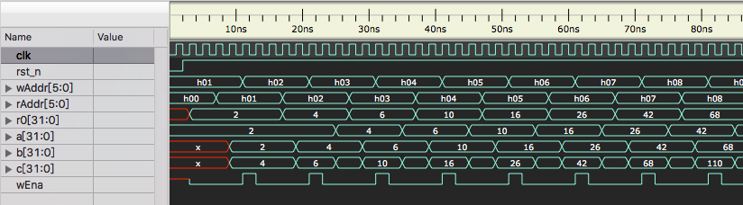
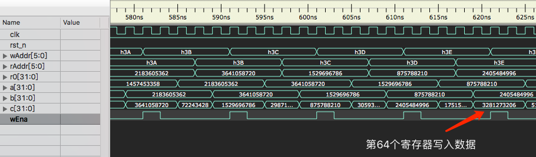
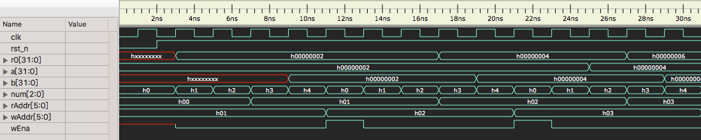
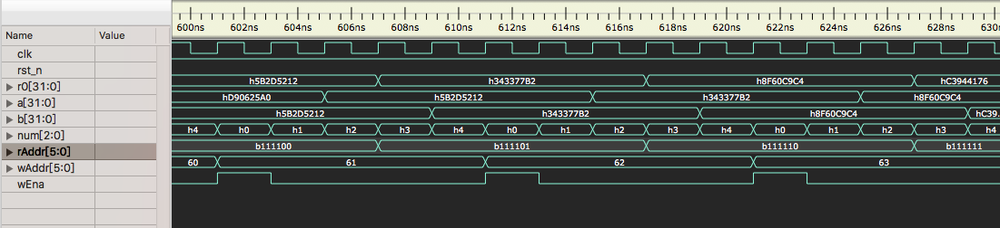
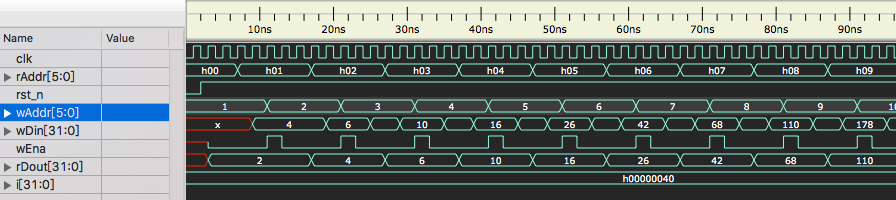
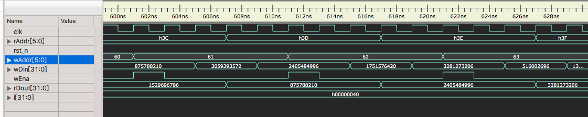

# lab02 Regfile

### 张立夫 PB15020718

## 实验目的

设计一 64*32bit 寄存器文件，即 64 个 32 位的寄存器文件（寄存器组）

- 具备一组读端口和一组写端口
- 通过读端口可从 0~31 号的任意地址读取数据
- 通过写端口可向 0~31 号的任意地址写入数据

Regfile 对外提供以下接口：

- 输入时钟信号：clk 和输入复位信号：rst_n
- 输入读取数据地址：rAddr 和输出读取出数据：rDout
- 输入写入数据地址：wAddr 和输入写入数据：wDin
- 输入写入使能：wEna

## 实验平台

- 操作系统：MacOS X
- 编译器：Icarus Verilog version 10.2
- 仿真波形查看：Scansion

## 实验要求

1. 调用实验一 ALU，完成以下功能
   - 寄存器文件组 r0, r1 初始化为 2，2，其他所有寄存器初始化为 0
   - 在 clk 控制下，依次完成以下计算，注意每个 clk 至多允许完成一次计算
     - r0 + r1 -> r2
     - r1 + r2 -> r3
     - ……
     - r61 + r62 -> r63
2. 结果在仿真中显示

## 实验过程

1. 创建 Regfile 文件 `regfile.v`
   - 在文件中定义 64*32bit 寄存器组 `reg [31:0] data [0:63]`
   - 使用 `always` 模块实现对读取地址数据的读取
   - 在 `rst_n` 下降沿的时候进行寄存器复位
     - data[0] 和 data[1] 复位为 2
     - 其余复位为 0
   - 在 `wEna` 为 1 时，对写入地址进行写入
2. 创建控制模块 `control.v`
   - 定义状态转换标志变量 `num` ，其有 5 个状态：
   - `num == 0` 写入使能 wEna 置零
   - `num == 1` 寄存器读取数据赋值给 ALU 操作数 a
   - `num == 2` 寄存器读取地址加一
   - `num == 3` 寄存器读取数据赋值给 ALU 操作数 b
   - `num == 4` 写入使能 wEna 置一，寄存器写入地址加一，计算结果写入寄存器
   - `rst_n` 下降沿触发时，将读地址置为零，写地址置为一
3. 创建顶层文件 `top.v` 
   - 提供时钟信号 clk 和复位信号 rst_n 的输入
   - 调用控制模块 `control.v` ，寄存器文件 `regfile.v` 和 ALU 模块 `alu.v` 
4. 创建测试文件 `test.v` 
   - 因本次除时钟与复位信号外，无其他输入，只需在起始时将 rst_n 置零触发
   - 之后通过 `repeat() @(posedge clk)` 进行 clk 信号的重复即可
5. 编译运行

```shell
iverilog -o test.vvp test.v
vvp test.vvp
open -a Scansion test.vcd
```

## 实验结果

1. `top.v` 仿真结果

   

   - 在使能 `wEna` 为 1 时对寄存器进行写入
   - a 和 b分别为加数，c 为结果

   

   - 最后几个寄存器的数据

2. `control.v` 仿真结果

   

   

3. `regfile.v` 仿真结果

   

   

## 实验总结

因为使用的 Scansion 无法看到在 `regfile.v` 中定义的寄存器组内数据，所以只能通过仿真的读写数据来进行判断，不够方便。

## 附录

### 源代码：

`top.v` :

```verilog
`timescale 1ns / 1ps
`include "regfile.v"
`include "alu.v"
`include "control.v"

module top(
	input clk,
	input rst_n
);

wire [31:0] r0, a, b, c;
wire [5:0] rAddr, wAddr;
wire wEna;

control con(clk, rst_n, r0, rAddr, wAddr, a, b, wEna);
regfile r(clk, rst_n, rAddr, r0, wAddr, c, wEna);
alu alu1(a, b, 5'h1, c);

endmodule
```

`regfile.v` :

```verilog
`timescale 1ns / 1ps

module regfile(
	input 			clk,
	input 			rst_n,
	input 	[5:0] 	rAddr,
	output reg	[31:0] 	rDout,
	input 	[5:0] 	wAddr,
	input 	[31:0] 	wDin,
	input			wEna
);

reg [31:0] data [0:63];
integer i;

always@(*) begin
	if(~wEna)
		rDout = data[rAddr];
end

always@(posedge clk or negedge rst_n) begin
	if(~rst_n) begin
		data[0] <= 32'h0002;
		data[1] <= 32'h0002;
		for(i = 2; i < 64; i = i + 1)
			data[i] <= 0;	
	end
	if(wEna)
		data[wAddr] = wDin;
end

endmodule
```

`control.v` :

```verilog
`timescale 1ns / 1ps

module control(
	input clk,
	input rst_n,
	input [31:0] r0,
	output reg [5:0] rAddr,
	output reg [5:0] wAddr,
	output reg [31:0] a,
	output reg [31:0] b,
	output reg wEna
);

reg [2:0] num;
	 
always@(posedge clk or negedge rst_n) begin
	if(~rst_n) begin
		rAddr <= 0;
		wAddr <= 1;
		num <= 0;
		a <= 2;
	end
	else if(num == 0) begin
		wEna <= 0;
		rAddr <= rAddr;
		num <= num + 1;
	end
	else if(num == 1) begin
		a <= r0;
		num <= num + 1;
	end
	else if(num == 2) begin
		num <= num + 1;
		rAddr <= rAddr + 1;
	end
	else if(num == 3) begin
		num <= num + 1;
		b <= r0;
	end
	else if(num == 4) begin
		wEna <= 1;
		num <= 0;
		wAddr <= wAddr + 1;
	end
end

endmodule
```

`alu.v` :

```verilog
`timescale 1ns / 1ps

module alu(
    input signed [31:0] alu_a,
    input signed [31:0] alu_b,
    input        [4:0]  alu_op,
    output reg signed [31:0] alu_out
);

parameter A_NOP = 5'h00;  //空运算
parameter	A_ADD = 5'h01;	//符号加
parameter	A_SUB = 5'h02;	//符号减
parameter	A_AND = 5'h03;	//与
parameter	A_OR = 5'h04;	//或
parameter	A_XOR = 5'h05;	//异或
parameter	A_NOR = 5'h06;	//或非

always@(*) begin
  case (alu_op)
    A_NOP: alu_out = alu_a;
    A_ADD: alu_out = alu_a + alu_b;
    A_SUB: alu_out = alu_a - alu_b;
    A_AND: alu_out = alu_a & alu_b;
    A_OR: alu_out = alu_a | alu_b;
    A_XOR: alu_out = alu_a ^ alu_b;
    A_NOR: alu_out = ~(alu_a | alu_b);
    default: alu_out = alu_a;
  endcase
end

endmodule
```

