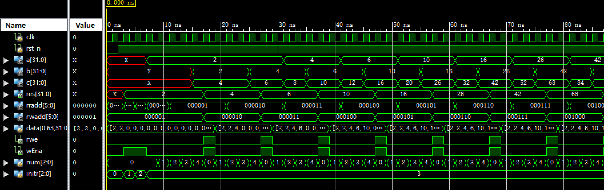
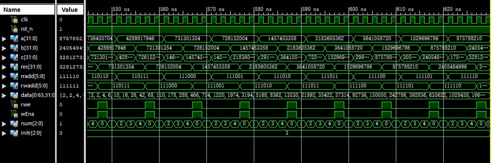
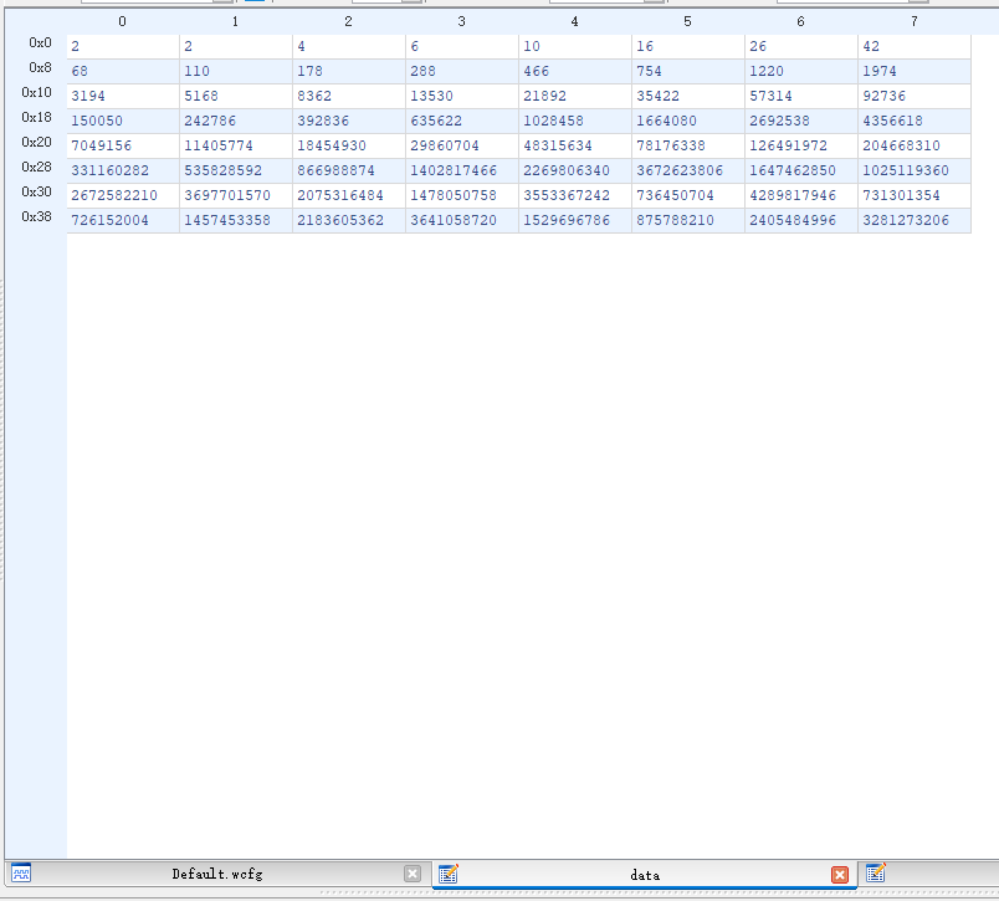
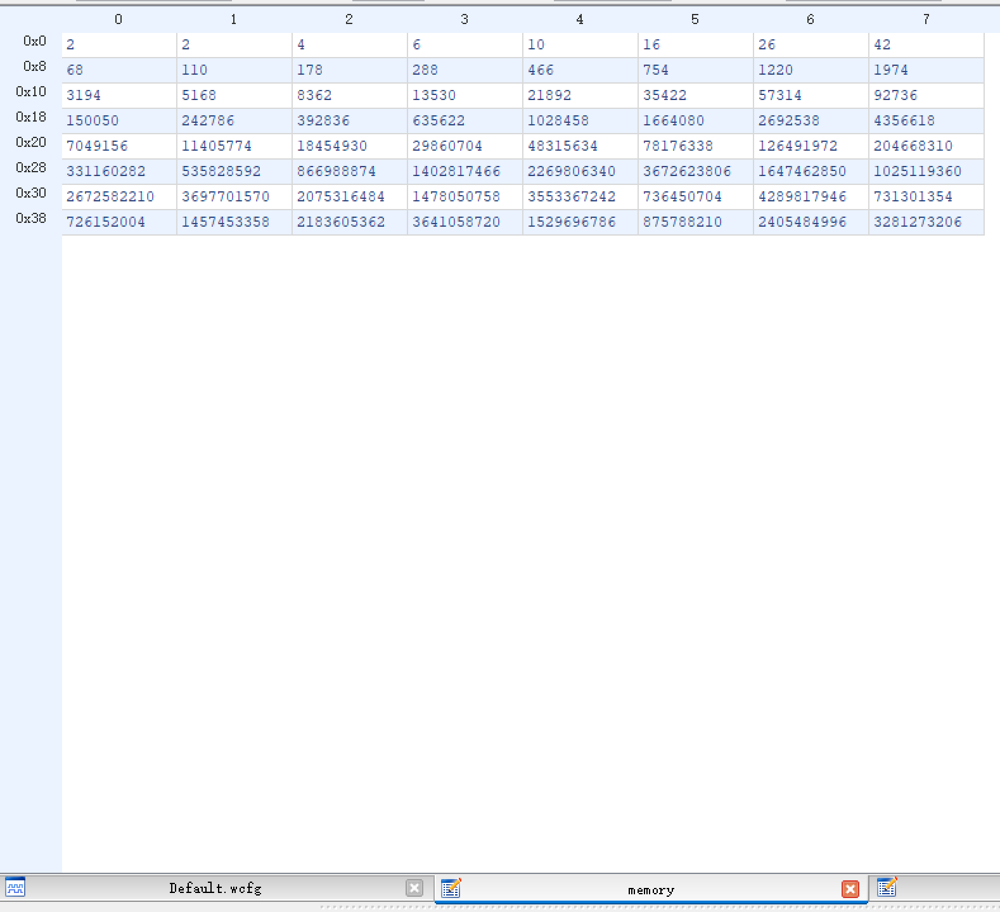
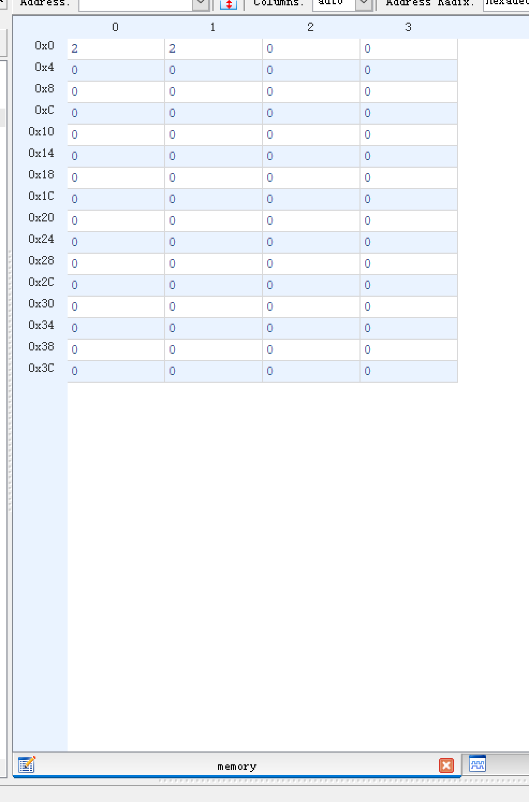

# lab03 RAM

### 张立夫 PB15020718

## 实验目的

1. 学习使用 ISE 的 IP 核
2. 学习使用Xilinx FPGA内的RAM资源
   - 例化一个简单双端口的RAM（32bitx64）
   - 使用coe文件对RAM进行初始化

## 实验平台

- 操作系统：Windows 10
- 编译仿真环境：Xilinx ISE 14.7

## 实验要求

1. 综合利用三次实验的结果，完成以下功能：

   - 从ram中0地址和1地址读取两个数，分别赋给reg0和reg1

   - 利用第二次实验的结果(ALU+Regfile)进行斐波拉契运算，运算结果保存在对应的寄存器

   - 运算结果同时保存在对应的ram地址中，即ram[0]<----->reg0, ram[1]<----->reg1,

        ram[2]<----->reg2,……

2. 实现一个control模块，完成整个运算的控制。

3. 实现一个顶层模块Top

   - 调用Ram
   - 调用RegFile
   - 调用ALU完成运算
   - 调用control模块，完成运算控制

## 实验过程

1. 创建 `ram`

   - 新建 IP 核选择 RAM & ROM
   - 选择简单双端口 RAM （一个读端口，一个写端口）
   - 选择宽度 32bit 深度 64
   - 关联初始化文件 `init.coe` 
   - 生成 RAM 模块

2. 创建控制模块 `control.v` 

   - 定义初始 Regfile 写入状态转换变量 `initr` ，初始为零
     - `initr < 2` Regfile 写入使能 wEna 置一，从 RAM 读取数据写入 Regfile，RAM 读取地址加一
     - `initr == 2` 将各个变量重新初始化，initr 加一
   - 定义状态转换标志变量 `num` ，其有 5 个状态：
     - `num == 0` RAM 和 Regfile 写入使能 rwe, wEna 置零
     - `num == 1` 从 RAM 读取数据赋值给 ALU 操作数 a，并将读地址加一
     - `num == 2` 从 RAM 读取第二个操作数
     - `num == 3` 把第二个操作数赋值给 ALU 操作数 b
     - `num == 4` RAM 和 Regfile 写入使能 rwe, wEna 置一，RAM 和 Regfile 写入地址加一，计算结果写入 RAM 和 Regfile
   - `rst_n` 下降沿触发时，将读地址置为零，写地址置为一，各个状态置零

3. 创建顶层文件 `top.v` 

   - 提供时钟信号 clk 和复位信号 rst_n 的输入
   - 调用 RAM 模块 `ram` ，控制模块 `control.v` ，寄存器文件 `regfile.v` 和 ALU 模块 `alu.v`
   - 将由 ALU 输出的结果传入控制模块，由控制模块进行控制何时写入

4. 寄存器文件 `regfile.v` 修改

   - 删去读端口，仅保留写端口
   - 在复位时将所有寄存器复位为 0

5. 仿真

   - 为正好将 64 个 RAM 存储单元和寄存器存满，故仅运行 630ns

## 实验结果

1. `top.v` 仿真结果

   

   

   - a，b，c 为 ALU 运算操作数，res 为运算后写入结果
   - data 为寄存器内数组
   - rradd 和 rwadd 为内存读写地址
   - rwe 和 wEna 为 RAM 和寄存器写入使能

2. 内存寄存器内数据：

   - 寄存器数据：

   

   - RAM 中数据：

   

3. RAM 初始化后数据：

   

## 实验总结

因为内存是在上升沿触发进行数据读取，所以相比上一个寄存器实验，需要在改变读取地址后等待一个时钟周期进行数据读取，否则将会出现数据读取延迟，无法进行正常运算的情况。

## 附录

### 源代码：

`top.v` :

```verilog
`timescale 1ns / 1ps

module top(
	input clk,
	input rst_n
);

wire [31:0] rrout, a, b, c, res;
wire [5:0] rradd, wAddr, rwadd;
wire wEna;

control con(clk, rst_n, c, rrout, rradd, rwadd, wAddr, a, b, res, rwe, wEna);
ram rr(
	.clka(clk),
	.addra(rwadd),
	.dina(res),
	.addrb(rradd), 
	.clkb(clk),
	.wea(rwe),
	.doutb(rrout)
);
regfile r(clk, rst_n, wAddr, res, wEna);
alu alu1(a, b, 5'h1, c);

endmodule
```

`control.v` :

```verilog
`timescale 1ns / 1ps

module control(
	input clk,
	input rst_n,
	input [31:0] c,
	input [31:0] rrout,
	output reg [5:0] rradd,
	output reg [5:0] rwadd,
	output reg [5:0] wAddr,
	output reg [31:0] a,
	output reg [31:0] b,
	output reg [31:0] res,
	output reg rwe,
	output reg wEna
);

reg [2:0] num, initr;
	 
always@(posedge clk or negedge rst_n) begin
	if(~rst_n) begin
		initr <= 0;
		rradd <= 0;
		rwadd <= 1;
		wAddr <= 1;
		rwe <= 0;
		wEna <= 0;
		num <= 0;
	end
	else if(initr < 2) begin
		initr <= initr + 1;
		wEna <= 1;
		rradd <= rradd + 1;
		res <= rrout;
	end
	else if(initr == 2) begin
		initr <= initr + 1;
		rradd <= 0;
		rwadd <= 1;
		wAddr <= 1;
		rwe <= 0;
		wEna <= 0;
		num <= 0;
		a <= 2;
	end
	else if(num == 0) begin
		rwe <= 0;
		wEna <= 0;
		rradd <= rradd;
		num <= num + 1;
	end
	else if(num == 1) begin
		a <= rrout;
		num <= num + 1;
		rradd <= rradd + 1;
	end
	else if(num == 2) begin
		num <= num + 1;
	end
	else if(num == 3) begin
		num <= num + 1;
		b <= rrout;
	end
	else if(num == 4) begin
		rwe <= 1;
		wEna <= 1;
		num <= 0;
		res <= c;
		rwadd <= rwadd + 1;
		wAddr <= wAddr + 1;
	end
end

endmodule
```

`regfile.v` :

```verilog
`timescale 1ns / 1ps

module regfile(
	input 			clk,
	input 			rst_n,
	input 	[5:0] 	wAddr,
	input 	[31:0] 	wDin,
	input			wEna
);

reg [31:0] data [0:63];
integer i;

always@(posedge clk or negedge rst_n) begin
	if(~rst_n) begin
		data[0] <= 32'h0002;
		data[1] <= 32'h0002;
		for(i = 2; i < 64; i = i + 1)
			data[i] <= 0;
	end
	if(wEna)
		data[wAddr] = wDin;
end

endmodule
```

`alu.v` :

```verilog
`timescale 1ns / 1ps

module alu(
    input signed [31:0] alu_a,
    input signed [31:0] alu_b,
    input        [4:0]  alu_op,
    output reg signed [31:0] alu_out
);

parameter A_NOP = 5'h00;  //空运算
parameter	A_ADD = 5'h01;	//符号加
parameter	A_SUB = 5'h02;	//符号减
parameter	A_AND = 5'h03;	//与
parameter	A_OR = 5'h04;	//或
parameter	A_XOR = 5'h05;	//异或
parameter	A_NOR = 5'h06;	//或非

always@(*) begin
  case (alu_op)
    A_NOP: alu_out = alu_a;
    A_ADD: alu_out = alu_a + alu_b;
    A_SUB: alu_out = alu_a - alu_b;
    A_AND: alu_out = alu_a & alu_b;
    A_OR: alu_out = alu_a | alu_b;
    A_XOR: alu_out = alu_a ^ alu_b;
    A_NOR: alu_out = ~(alu_a | alu_b);
    default: alu_out = alu_a;
  endcase
end

endmodule
```

`init.coe`

```
MEMORY_INITIALIZATION_RADIX=10;
MEMORY_INITIALIZATION_VECTOR=2,2,0;
```

