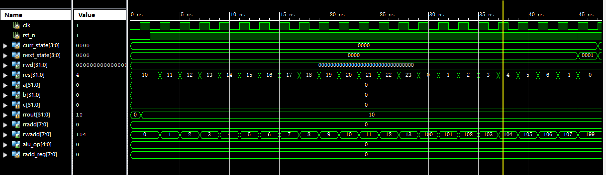
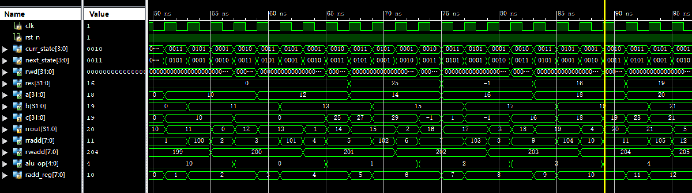
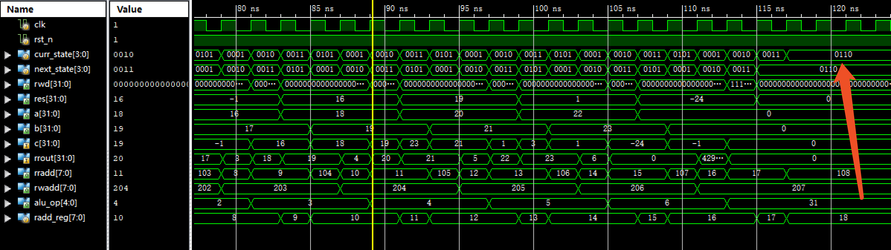
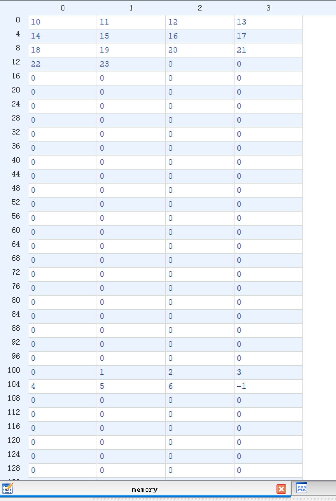
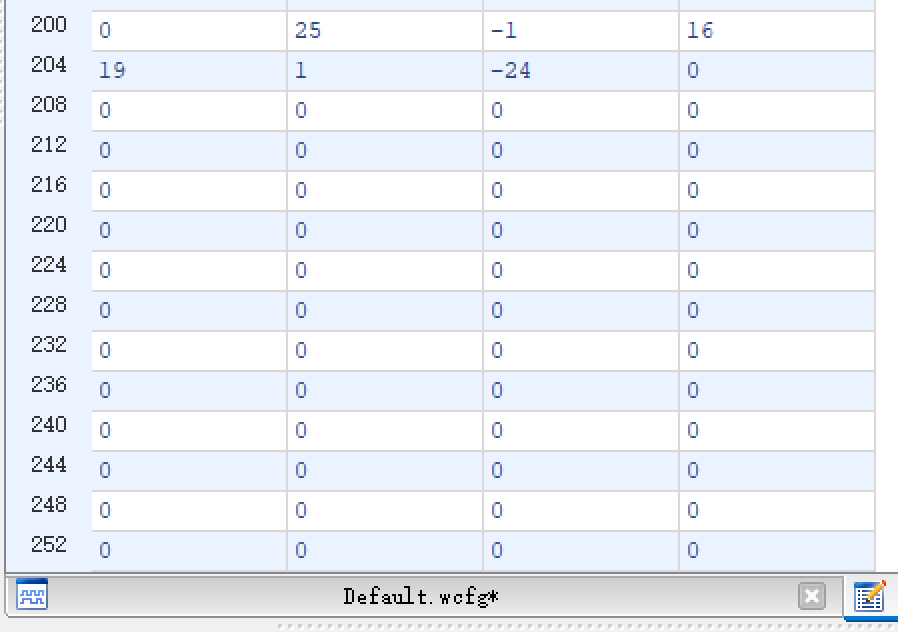

# lab04 时序与状态机

### 张立夫 PB15020718

## 实验目的

1. 了解并掌握时序逻辑电路设计
2. 掌握三段式状态机的设计与使用

## 实验平台

- 操作系统：Windows 10
- 编译仿真环境：Xilinx ISE 14.7

## 实验要求

- 使用状态机控制运算过程（数据读取，计算，数据写入），每部加法运算所用时钟数不允许超过五个。典型的，三个clk读取数据和操作符，一个clk计算，一个clk向ram写入结果。

- 仿真激励文件模块只允许出现clk和rst信号输入。

- 实现一个control模块，完成整个运算的控制。

- 实现一个顶层模块Top

- - 调用Ram模块
  - 调用RegFile
  - 调用ALU完成加法运算
  - 调用control模块，完成运算控制

## 实验过程

1. 创建 `ram`

  - 新建 IP 核选择 RAM & ROM
  - 选择简单双端口 RAM （一个读端口，一个写端口）
  - 选择宽度 32bit 深度 256
  - 生成 RAM 模块
2. 创建控制模块 `control.v` 
   - 定义有限状态机以下状态：
     - `idle` 初始状态，对内存进行初始化赋值
     - `read0` 读取第一个操作数，寄存器写入使能置一
     - `read1` 读取第二个操作数，记录当前操作数内存位置，内存写入使能置一
     - `read2` 读取操作符，操作符地址寄存器增一，寄存器写入使能置零
     - `write` 将运算结果写回内存，内存写入使能置零
     - `stop` 结束有限状态机循环，内存和寄存器写入使能置零
   - 定义初始化计数器 `num` ，在 `idle` 状态下进行初始化：
     - `num < 13` 给 RAM 地址 0 - 12 赋值 10 - 22
     - `num == 13` 给 RAM 地址 13 赋值 23，内存写入地址跳转至 100
     - `13 < num < 20` 给 RAM 地址 100 - 106 赋值 0 - 6 
     - `num == 20` 给 RAM 地址 107 赋值 -1
     - `num == 21` 将 RAM 写入地址跳转至 199，等待之后写入计算结果
   - 该状态机为基于现态的状态机，实现实验要求仅需四个周期，分别是三个读周期与一个写周期
   - 状态循环如下：
     - 初始状态置为 `idle` 
     - 当 `num < 22` 时，为循环：`idle` -> `idle` 
     - 当 `num >= 22` 后，进入正常循环：`idle` -> `read0` 
     - 正常循环周期：`read0` -> `read1` -> `read2` -> `write` -> `read0` 
     - 在 `read2` 状态下，如果读取的操作符为负一，即 `alu_op == -1` ，跳转至 `stop` 状态
3. 创建顶层文件 `top.v` 
   - 提供时钟信号 clk 和复位信号 rst_n 的输入
   - 调用 RAM 模块 `ram` ，控制模块 `control.v` ，寄存器文件 `regfile.v` 和 ALU 模块 `alu.v`
   - 将由 ALU 输出的结果传入控制模块，由控制模块进行控制何时写入
4. 进行仿真

## 实验结果

1. `top.v` 仿真：

   

   - res 为初始化向内存中写入数据
   - rwadd 为初始化向内存中写入的地址

   

   - a，b，c 为 ALU 运算操作数，alu_op 为运算符，res 为运算后写入结果
   - rradd 和 rwadd 为内存读写地址
   - curr_state 和 next_state 为当前和之后状态
   - **一共使用四个周期实现**

   

   - 箭头所指即位进入 `stop` 状态

2. 内存中数据：

   

   - 初始化后的数据

   

   - 运算结果

## 实验总结

首先实现了四个周期完成，后发现计算过程无需占用一个周期，故将运算周期去除，达到四个周期实现。

## 附录

### 源代码

`top.v` :

```verilog
`timescale 1ns / 1ps

module top(
	input clk,
	input rst_n
);

wire [31:0] rrout, a, b, c, res, rwd;
wire [7:0] rradd, rwadd;
wire [5:0] wAddr;
wire [4:0] alu_op;
wire wEna;

control con(clk, rst_n, c, rrout, alu_op, rradd, rwadd, wAddr, a, b, rwd, res, rwe, wEna);
ram rr(
	.clka(clk),
	.addra(rwadd),
	.dina(res),
	.addrb(rradd), 
	.clkb(clk),
	.wea(rwe),
	.doutb(rrout)
);
regfile r(clk, rst_n, wAddr, rwd, wEna);
alu alu1(a, b, alu_op, c);

endmodule
```

`control.v` :

```verilog
`timescale 1ns / 1ps

module control(
	input clk,
	input rst_n,
	input [31:0] c,
	input [31:0] rrout,
	output reg signed [4:0] alu_op,
	output reg [7:0] rradd,
	output reg [7:0] rwadd,
	output reg [5:0] wAddr,
	output reg [31:0] a,
	output reg [31:0] b,
	output reg [31:0] rwd,
	output reg [31:0] res,
	output reg rwe,
	output reg wEna
);

parameter idle = 3'h0;
parameter read0 = 3'h1;
parameter read1 = 3'h2;
parameter read2 = 3'h3;
parameter write = 3'h5;
parameter stop = 3'h6;

reg [3:0] curr_state, next_state;
reg [4:0] num;
reg [7:0] radd_reg, op_reg;
	 


always@(posedge clk or negedge rst_n) begin
	if (~rst_n)
		curr_state <= idle;
	else
		curr_state <= next_state;
end

always@(*) begin
	case(curr_state)
		idle:
			if (num < 22) next_state = idle;
			else next_state = read0;
		read0:
			next_state = read1;
		read1:
			next_state = read2;
		read2:
			if (alu_op == -1) next_state = stop;
			else next_state = write;
		write:
			next_state = read0;
		stop:
			next_state = stop;
		default:
			next_state = idle;
	endcase
end

always@(posedge clk or negedge rst_n) begin
	if (~rst_n) begin
		rradd <= 0;
		rwadd <= 0;
		op_reg <= 8'd100;
		wAddr <= 0;
		rwe <= 1;
		wEna <= 0;
		num <= 0;
		res <= 10;
		rwd <= 0;
		a <= 0;
		b <= 0;
		alu_op <= 0;
		radd_reg <= 0;
	end
	else if (curr_state == idle) begin
		if (num < 13) begin
			rwadd <= rwadd + 1;
			num <= num + 1;
			res <= res + 1;
		end
		else if (num == 13) begin
			rwadd <= 100;
			num <= num + 1;
			res <= 0;
		end
		else if (num < 20) begin
			rwadd <= rwadd + 1;
			num <= num + 1;
			res <= res + 1;
		end
		else if (num == 20) begin
			rwadd <= rwadd + 1;
			res <= -1;
			num <= num + 1;
		end
		else if (num == 21) begin
			rwadd <= 199;
			res <= 0;
			num <= num + 1;
		end
	end
	else if (curr_state == read0) begin
		alu_op <= rrout;
		rradd <= rradd + 1;
		wAddr <= 0;
		wEna <= 1;
		rwd <= rrout;
	end
	else if (curr_state == read1) begin
		res <= c;
		radd_reg <= rradd;
		wAddr <= wAddr + 1;
		a <= rrout;
		rwd <= rrout;
		rwe <= 1;
	end
	else if (curr_state == read2) begin
		radd_reg <= radd_reg + 1;
		rradd <= op_reg;
		b <= rrout;
		op_reg <= op_reg + 1;
		wAddr <= wAddr + 1;
		wEna <= 0;
		
	end
	else if (curr_state == write) begin
		rwe <= 0;
		rwadd <= rwadd + 1;
		rradd <= radd_reg;
	end
	else if (curr_state == stop) begin
		rwe <= 0;
		wEna <= 0;
	end
end

endmodule
```

`regfile.v` :

```verilog
`timescale 1ns / 1ps

module regfile(
	input 			clk,
	input 			rst_n,
	input 	[5:0] 	wAddr,
	input 	[31:0] 	wDin,
	input			wEna
);

reg [31:0] data [0:63];
integer i;

always@(posedge clk or negedge rst_n) begin
	if(~rst_n) begin
		data[0] <= 32'h0002;
		data[1] <= 32'h0002;
		for(i = 2; i < 64; i = i + 1)
			data[i] <= 0;
	end
	if(wEna)
		data[wAddr] = wDin;
end

endmodule
```

`alu.v` :

```verilog
`timescale 1ns / 1ps

module alu(
    input signed [31:0] alu_a,
    input signed [31:0] alu_b,
    input        [4:0]  alu_op,
    output reg signed [31:0] alu_out
);

parameter A_NOP = 5'h00;  //空运算
parameter	A_ADD = 5'h01;	//符号加
parameter	A_SUB = 5'h02;	//符号减
parameter	A_AND = 5'h03;	//与
parameter	A_OR = 5'h04;	//或
parameter	A_XOR = 5'h05;	//异或
parameter	A_NOR = 5'h06;	//或非

always@(*) begin
  case (alu_op)
    A_NOP: alu_out = 32'h0;
    A_ADD: alu_out = alu_a + alu_b;
    A_SUB: alu_out = alu_a - alu_b;
    A_AND: alu_out = alu_a & alu_b;
    A_OR: alu_out = alu_a | alu_b;
    A_XOR: alu_out = alu_a ^ alu_b;
    A_NOR: alu_out = ~(alu_a | alu_b);
    default: alu_out = alu_a;
  endcase
end

endmodule
```

`test.v` :

```verilog
`timescale 1ns / 1ps

module test;

	// Inputs
	reg clk;
	reg rst_n;

	// Instantiate the Unit Under Test (UUT)
	top uut (
		.clk(clk), 
		.rst_n(rst_n)
	);
	always #1 clk = ~clk;
	initial begin
		// Initialize Inputs
		clk = 0;
		rst_n = 0;

		// Wait 100 ns for global reset to finish
		#2;
		rst_n = 1;
		repeat(500) @(posedge clk);
		// Add stimulus here

	end
      
endmodule
```

