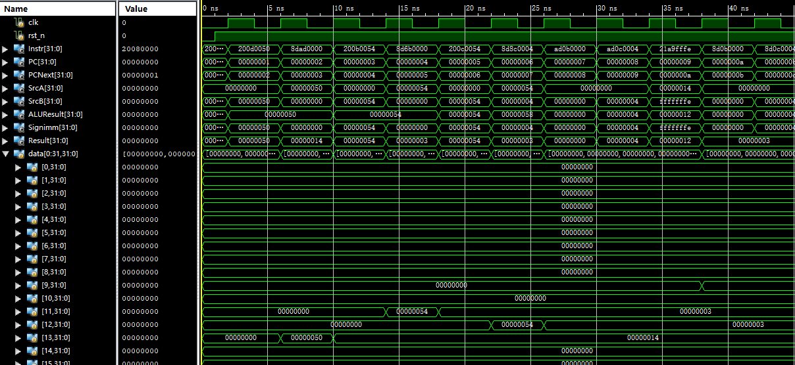
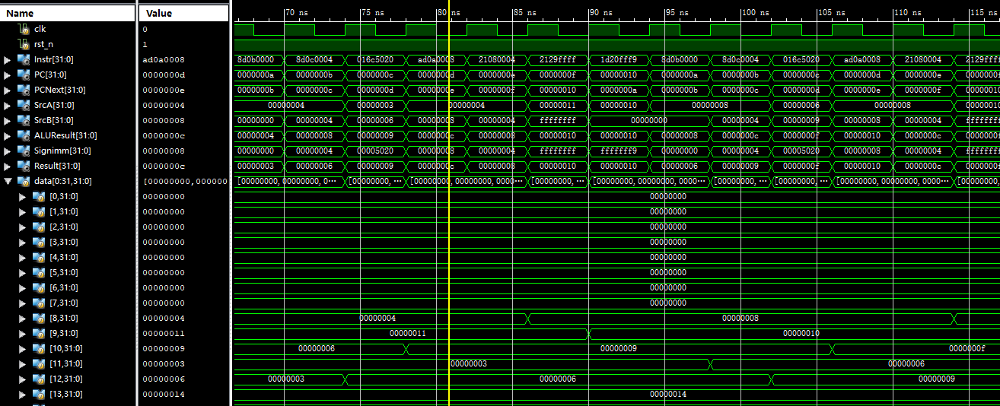
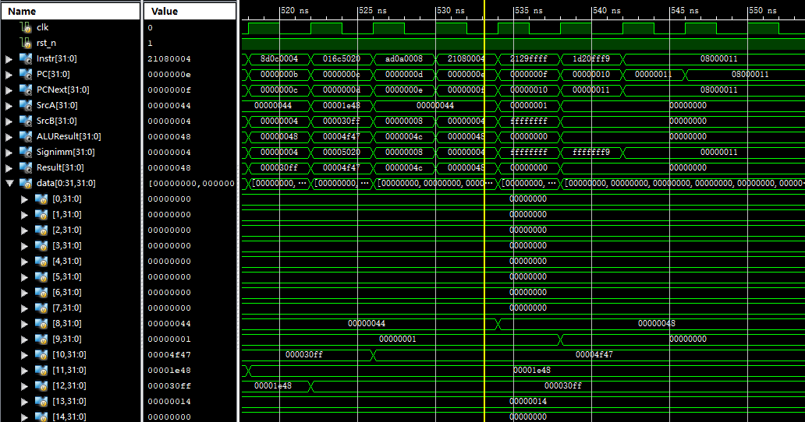
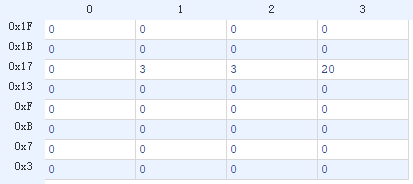
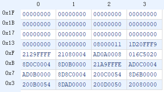
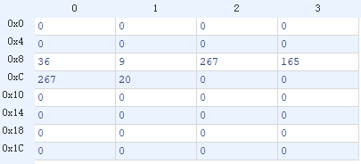
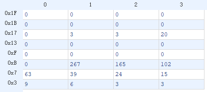
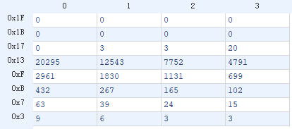
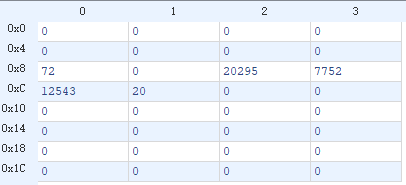
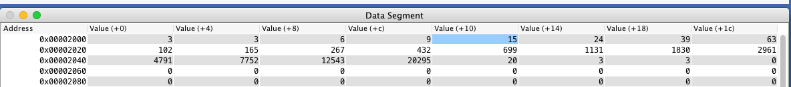

# lab05 单周期 CPU

### 张立夫 PB15020718

## 实验目的

1. 通过实验熟悉 MIPS 指令集
2. 掌握单周期 CPU 实现方式
3. 实现对给定 MIPS 指令的执行

## 实验平台

- 操作系统：Windows 10
- 编译环境：Xilinx ISE 14.7
- 仿真：ISim
- 指令编译环境：Mars 4.5

## 实验要求

1. 设计CPU，完成所给程序代码的执行，其功能是起始数为3和3的斐波拉契数列的计算。只计算20个数
2. 需要例化两个mem，一个存放指令，一个存放数据,首地址均为0
3. 本次实验要求设计为单周期CPU，基本思路是依据给定过的指令集（6条），设计核心的控制信号。依据前面给定的数据通路和控制单元信号进行设计
4. 注意现在涉及到两个ram，一个regfile，现在均要求是异步读，同步写
5. 涉及到的指令：
   - addi
   - add
   - lw
   - sw
   - bgtz
   - j

需实现程序：

```asm
 .data
fibs: .word   0 : 20        # "array" of  20 words to contain fib values
size: .word  20             # size of "array" 
temp: .word 3 3
      .text
      la   $t0, fibs        # load address of array
      la   $t5, size        # load address of size variable
      lw   $t5, 0($t5)      # load array size
      la   $t3, temp	    # load 
      lw   $t3, 0($t3)
      la   $t4, temp
      lw   $t4, 4($t4)

      sw   $t3, 0($t0)      # F[0] = $t3
      sw   $t4, 4($t0)      # F[1] = $t4
      addi $t1, $t5, -2     # Counter for loop, will execute (size-2) times
loop: lw   $t3, 0($t0)      # Get value from array F[n] 
      lw   $t4, 4($t0)      # Get value from array F[n+1]
      add  $t2, $t3, $t4    # $t2 = F[n] + F[n+1]
      sw   $t2, 8($t0)      # Store F[n+2] = F[n] + F[n+1] in array
      addi $t0, $t0, 4      # increment address of Fib. number source
      addi $t1, $t1, -1     # decrement loop counter
      bgtz $t1, loop        # repeat if not finished yet.
out:  
	  j out
```

## 实验过程

### 指令编译

1. 编译导出十六位指令
   - 将上述程序导入 Mars
   - 对其进行部署
   - 导出为十六进制
2. 对导出的代码进行修改
   - 将部分地址段进行修改以实现对 Data Memory 的正确访问
3. 生成 coe 文件
   - Instruction Memory：即为上述十六进制指令，文件为：`InsMem.coe`
   - Data Memory：前 20 位留空（设为 0 ）以存放计算结果，第 21 位设为 20（数组长度），22、 23 位设为 3（初始数据），采用十进制，文件为：`DataMem.coe`
   - 源码见附录

### 编写 CPU

1. 创建 `Ram` 
   - 创建两个 Ram，分别对应 Instruction Memory 和 Data Memory
   - IP 核选择 Distributed Memory Generator，实现异步读取
   - 选择 Single Port
   - 设定为 32 * 32 bits
   - 初始化文件分别选择 `InsMem.coe` 和 `DataMem.coe`

2. 创建控制模块 `Control.v`
   - 输入为 `Instr[31:26]` 作为操作数 `op` 和 `Instr[5:0]` 作为 `funct`
   - 输出控制信号如下：
     - `Jump` 控制进行 J 指令跳转
     - `MemtoReg` 控制从 Mem 读取数据写回 Reg
     - `MemWrite` 控制向 Mem 写入数据
     - `Branch` 控制分支跳转
     - `ALUSrc` 控制 ALU 第二个操作数来源选择 Reg 或立即数
       - `ALUSrc == 1` 选择立即数
       - `ALUSrc == 0` 选择 Reg
     - `RegDst` 控制 Reg 写地址选择 rd 或是 rt
       - `RegDst == 1` 选择 rd
       - `RegDst == 0` 选择 rt
     - `RegWrite` 控制向 Reg 中写入数据
     - `[2:0] ALUControl` ALU 控制信号
       - `ALUControl == 1` ALU 进行加法运算
       - `ALUControl == 2` ALU 进行减法运算
       - `ALUControl == 0` 默认输出 0
   - 通过 `op` 与 `funct` 位进行对指令的选择，对控制信号赋值进行输出
   - 本实验中各指令对应 `op` 与 `funct` 位如下：

   |            | `add` | `addi` | `lw`  | `sw`  | `bgtz` | `j`  |
   | :--------: | :---: | :----: | :---: | :---: | :----: | :--: |
   |  op[6:0]   | 6'h0  |  6'h8  | 6'h23 | 6'h2b |  6'h7  | 6'h2 |
   | funct[6:0] | 6'h20 |  N/A   |  N/A  |  N/A  |  N/A   | N/A  |

   - 本实验中各指令输出控制信号如下：

|  指令  | Jump | MemtoReg | MemWrite | Branch | ALUSrc | RegDst | RegWrite | ALUCtrl |
| :----: | :--: | :------: | :------: | :----: | :----: | :----: | :------: | :-----: |
| `add`  |  0   |    0     |    0     |   0    |   0    |   1    |    1     |    1    |
| `addi` |  0   |    0     |    0     |   0    |   1    |   0    |    1     |    1    |
|  `lw`  |  0   |    1     |    0     |   0    |   1    |   0    |    1     |    1    |
|  `sw`  |  0   |    0     |    1     |   0    |   1    |   0    |    0     |    1    |
| `bgtz` |  0   |    0     |    0     |   1    |   0    |   0    |    0     |    2    |
|  `j`   |  1   |    0     |    0     |   0    |   0    |   0    |    0     |    0    |

3. 修改 `RegFile.v` 
   - 为之前写好的 `RegFile.v` 增加一个异步读端口
   - 目前具有两个异步读端口，一个同步写端口
   - 在 `rst_n` 信号为低电平时将所有寄存器初始化为 0
4. 修改 `ALU.v`
   - 增加一个信号输出端口 `Zero` 
   - 当 `alu_out > 0` 时 `Zero` 为 1，以实现 `bgtz` 的分支跳转
   - `alu_op` 即为 `ALUControl` 
5. 实现 PC
   - 通过四个模块实现对跳转和非跳转指令的 PC 操作
   - `PC_Plus4.v` ：对 PC 进行自增，考虑到 IP 核实现的 Ram 中地址间隔为 1，故其每次增加为 1
   - `PC_BMUX.v` ：由 `PCSrc` 控制，当其为 1 时进行分支，将立即数与 `PC_Plus4.v` 的输出相加得到新的指令地址，同样考虑到 Ram 中地址间隔为 1，所以无需对立即数进行移位操作，若 `PCSrc` 为 0，则其输出即为 `PC_Plus4.v` 输出
   - `PC_JMUX.v` ：由 `Jump` 控制，当其为 1 时进行跳转，其输出的 [27:0] 为立即数的 [27:0] 部分，[31:28] 为 `PCPlus4.v` 输出的 [31:28] 部分，同样因为 Ram 中地址间隔，所以立即数也无需进行移位
   - `PC.v` 为同步时序逻辑，在 clk 上升沿时将 `PC_JMUX.v` 的输出赋值给其输出，在 `rst_n` 为低电平时将其输出设为 0
6. 实现符号位扩展模块 `Ext.v` 
   - 输出 [15:0] 位即为立即数的 [15:0] 位
   - 输出 [31:16] 位根据立即数第 15 位进行补全：
     - 当其为 1 时，补全为 `16'hffff`
     - 当其为 0 时，补全为 `16'h0000`
7. 实现各控制信号多选器：
   - `MA_MUX.v` ：由 `MemtoReg` 控制选择 `ReadData` 或 `ALUResult` 作为输出
   - `RD_MUX.v` ：由 `RegDst` 控制选择 rd 或 rt 作为写入寄存器
   - `RI_MUX.v` ：由 `ALUSrc` 控制选择寄存器或立即数作为 ALU 的第二个操作数
8. 其他模块：
   - `BA_AND.v` ：将 `Branch` 和由 `ALU.v` 输出的 `Zero` 信号进行与操作，得到 `PCSrc` 信号
   - `DMMv.v` ：因为 Data Memory 中地址间隔为 1，所以需要将 `ALU` 的输出 `ALUResult` 右移两位，将其作为地址输出
9. 创建 `top.v` ：
   - 提供时钟信号 clk 和复位信号 rst_n 的输入
   - 调用上述各种模块，由 `Control.v` 模块产生控制信号
   - 例化两个内存模块： `InsMem` 和 `DataMem` ，`InsMem` 的 `we` 和 `d` 均设为常数 0

## 实验结果

1. `top.v` 仿真：

   

   - 初始状态

   

   - 执行过程中

   

   - 进入最终 `out` 循环

2. 内存与寄存器中数据：

   

   - Data Memory 初始化值

   

   - Instruction Memory 初始化值

   

   - 执行过程中寄存器中数值

   

   - 执行过程中 Data Memory 中数值

   

   - 执行结束后 Data Memory 中数值

   

   - 执行结束后寄存器中数值

   

   - 在 Mars 4.5 中执行相应指令结束后所得数据结果

## 实验总结

本次实验熟悉了 MIPS 三种类型指令的执行过程，并成功仿真了单周期 CPU 的工作。在实现过程中对地址的操作进行了一些修改，以适应由 IP 核生成的地址间隔为 1 的存储结构。

## 附录

### 源代码

`top.v` :

```verilog
`timescale 1ns / 1ps

module top(
	input clk,
	input rst_n
);

wire [31:0] Instr, PC, PCPlus4, PCBOut, PCNext, SrcA, SrcB, Result, RD2, Signimm, ALUResult, ReadData;
wire [4:0] WriteReg, Add;
wire [2:0] ALUControl;
wire Jump, MemtoReg, MemWrite, Branch, ALUSrc, RegDst, RegWrite, PCSrc, Zero;

Control Con(Instr[31:26], Instr[5:0], Jump, MemtoReg, MemWrite, Branch, ALUSrc, RegDst, RegWrite, ALUControl);
Ram InsMem(
	.a(PC[4:0]), 
	.clk(clk),
	.we(1'b0),
	.d(32'b0),
	.spo(Instr)
);
RegFile Reg(
	.clk(clk), 
	.rst_n(rst_n), 
	.RegWrite(RegWrite), 
	.rAddr0(Instr[25:21]), 
	.rAddr1(Instr[20:16]), 
	.wAddr(WriteReg), 
	.wDin(Result), 
	.rDout0(SrcA), 
	.rDout1(RD2)
);
Ext E(Instr[15:0], Signimm);
ALU Alu(SrcA, SrcB, ALUControl, Zero, ALUResult);
DMMv MV(ALUResult[6:0], Add);
Ram1 DataMem(
	.a(Add),
	.clk(clk),
	.spo(ReadData),
	.we(MemWrite),
	.d(RD2)
);
PC Pc(clk, rst_n, PCNext, PC);
PC_BMUX PBMUX(PCSrc, PCPlus4, Signimm, PCBOut);
PC_JMUX PJMUX(Jump, PCPlus4[31:28], Instr[27:0], PCBOut, PCNext);
PC_Plus4 PCPlus(PC, PCPlus4);
BA_AND And(Branch, Zero, PCSrc);
MA_MUX MAMUX(MemtoReg, ALUResult, ReadData, Result);
RD_MUX RDMUX(RegDst, Instr[20:16], Instr[15:11], WriteReg);
RI_MUX RIMUX(ALUSrc, RD2, Signimm, SrcB);

endmodule
```

`Control.v` :

```verilog
`timescale 1ns / 1ps

module Control(
	input [5:0] opcode,
	input [5:0] funct,
	output reg Jump,
	output reg MemtoReg,
	output reg MemWrite,
	output reg Branch,
	output reg ALUSrc,
	output reg RegDst,
	output reg RegWrite,
	output reg [2:0] ALUControl
);

always@(opcode or funct) begin
	case(opcode)
		6'h0:		// add
			case(funct)
				6'h20: begin
					Jump = 0;
					MemtoReg = 0;
					MemWrite = 0;
					ALUSrc = 0;
					RegDst = 1;
					RegWrite = 1;
					Branch = 0;
					ALUControl = 3'b001;
				end
				default: begin
					Jump = 0;
					MemtoReg = 0;
					MemWrite = 0;
					ALUSrc = 0;
					RegDst = 0;
					RegWrite = 0;
					Branch = 0;
					ALUControl = 0;
				end
			endcase
		6'h8: begin		// addi
			Jump = 0;
			MemtoReg = 0;
			MemWrite = 0;
			ALUSrc = 1;
			RegDst = 0;
			RegWrite = 1;
			Branch = 0;
			ALUControl = 3'b001;
		end 
		6'h23: begin 	// lw
			Jump = 0;
			MemtoReg = 1;
			MemWrite = 0;
			ALUSrc = 1;
			RegDst = 0;
			RegWrite = 1;
			Branch = 0;
			ALUControl = 3'b001;
		end
		6'h2b: begin 	// sw
			Jump = 0;
			MemtoReg = 0;
			MemWrite = 1;
			ALUSrc = 1;
			RegDst = 0;
			RegWrite = 0;
			Branch = 0;
			ALUControl = 3'b001;
		end
		6'h7: begin 	// bgtz
			Jump = 0;
			MemtoReg = 0;
			MemWrite = 0;
			ALUSrc = 0;
			RegDst = 0;
			RegWrite = 0;
			Branch = 1;
			ALUControl = 3'b010;
		end
		6'h2: begin 	// j
			Jump = 1;
			MemtoReg = 0;
			MemWrite = 0;
			ALUSrc = 0;
			RegDst = 0;
			RegWrite = 0;
			Branch = 0;
			ALUControl = 0;
		end
		default: begin
			Jump = 0;
			MemtoReg = 0;
			MemWrite = 0;
			ALUSrc = 0;
			RegDst = 0;
			RegWrite = 0;
			Branch = 0;
			ALUControl = 0;
		end
	endcase
end

endmodule
```

`RegFile.v` :

```verilog
`timescale 1ns / 1ps

module RegFile(
	input 			clk,
	input 			rst_n,
	input			RegWrite,
	input 	[4:0] 	rAddr0,
	input	[4:0]	rAddr1,
	input 	[4:0] 	wAddr,
	input 	[31:0] 	wDin,
	output	[31:0] 	rDout0,
	output	[31:0]  rDout1
);

reg [31:0] data [0:31];
integer i;

assign rDout0 = data[rAddr0];
assign rDout1 = data[rAddr1];

always@(posedge clk or negedge rst_n) begin
	if(~rst_n) begin
		for(i = 0; i < 32; i = i + 1)
			data[i] <= 0;	
	end
	else if(RegWrite == 1'b1)
		data[wAddr] <= wDin;
end

endmodule
```

`ALU.v` :

```verilog
`timescale 1ns / 1ps

module ALU(
    input signed [31:0] alu_a,
    input signed [31:0] alu_b,
    input        [2:0]  alu_op,
    output reg Zero,
    output reg signed [31:0] alu_out
);

parameter   A_NOP = 2'h00;  
parameter	A_ADD = 2'h01;	
parameter	A_SUB = 2'h02;	
parameter	A_AND = 2'h03;
parameter	A_OR = 2'h04;
parameter	A_XOR = 2'h05;
parameter	A_NOR = 2'h06;

always@(*) begin
  case (alu_op)
    A_NOP: alu_out = 32'h0;
    A_ADD: alu_out = alu_a + alu_b;
    A_SUB: alu_out = alu_a - alu_b;
    A_AND: alu_out = alu_a & alu_b;
    A_OR: alu_out = alu_a | alu_b;
    A_XOR: alu_out = alu_a ^ alu_b;
    A_NOR: alu_out = ~(alu_a | alu_b);
    default: alu_out = alu_a;
  endcase
  if (alu_out > 0)
    Zero = 1;
  else
    Zero = 0;
end

endmodule
```

`PC.v` :

```verilog
`timescale 1ns / 1ps

module PC(
    input clk,
    input rst_n,
    input [31:0] PC_in,
    output reg [31:0] PC_out
);

always@(posedge clk or negedge rst_n) begin
    if (~rst_n)
        PC_out <= 0;
    else
        PC_out <= PC_in;
end

endmodule
```

`PC_Plus4.v` :

```verilog
`timescale 1ns / 1ps

module PC_Plus4(
    input [31:0] PC_in,
    output [31:0] PC_out
);

assign PC_out = PC_in + 1;

endmodule
```

`PC_BMUX.v` :

```verilog
`timescale 1ns / 1ps

module PC_BMUX(
    input PCSrc,
    input [31:0] PCPlus4,
    input [31:0] imm,
    output reg [31:0] PCNext
);

always@(*) begin
    if (PCSrc)
        PCNext = PCPlus4 + imm;
    else
        PCNext = PCPlus4;
end

endmodule
```

`PC_JMUX.v` :

```verilog
`timescale 1ns / 1ps

module PC_JMUX(
    input Jump,
    input [3:0] PCPlus4,
    input [27:0] ins,
    input [31:0] PC_BMUX,
    output reg [31:0] PC_out
);

always@(*) begin
    if (Jump) begin
        PC_out[27:0] = ins;
        PC_out[31:28] = PCPlus4;
    end
    else
        PC_out = PC_BMUX;
end

endmodule
```

`Ext.v` :

```verilog
`timescale 1ns / 1ps

module Ext(
    input [15:0] imm_in,
    output [31:0] imm_out
);

assign imm_out[15:0] = imm_in;
assign imm_out[31:16] = imm_in[15]? 16'hffff: 16'h0000;

endmodule
```

`DMMv.v` :

```verilog
`timescale 1ns / 1ps

module DMMv(
	input [6:0] ALUResult,
	output [4:0] Add
    );

assign Add = ALUResult >> 2;

endmodule
```

`BA_AND.v` :

```verilog
`timescale 1ns / 1ps

module BA_AND(
    input Branch,
    input Zero,
    output PCSrc
);

assign PCSrc = Branch & Zero;

endmodule
```

`MA_MUX.v` :

```verilog
`timescale 1ns / 1ps

module MA_MUX(
    input MemtoReg,
    input [31:0] ALUResult,
    input [31:0] ReadData,
    output [31:0] Result
);

assign Result = MemtoReg? ReadData: ALUResult;

endmodule
```

`RD_MUX.v` :

```verilog
`timescale 1ns / 1ps

module RD_MUX(
    input RegDst,
    input [4:0] ins0,
    input [4:0] ins1,
    output [4:0] WriteReg
);

assign WriteReg = RegDst? ins1: ins0;

endmodule
```

`RI_MUX.v` :

```verilog
`timescale 1ns / 1ps

module RI_MUX(
    input ALUSrc,
    input [31:0] RegData,
    input [31:0] ImmData,
    output [31:0] SrcB
);

assign SrcB = ALUSrc? ImmData: RegData;

endmodule
```

`test.v` :

```verilog
`timescale 1ns / 1ps

module t;

	// Inputs
	reg clk;
	reg rst_n;

	// Instantiate the Unit Under Test (UUT)
	top uut (
		.clk(clk),
		.rst_n(rst_n)
	);
	always #2 clk = ~clk;
	initial begin
		// Initialize Inputs
		clk = 0;
		rst_n = 0;

		// Wait 100 ns for global reset to finish
		#1;
		rst_n = 1;
        
		// Add stimulus here

	end
      
endmodule
```

`DataMem.coe` :

```
MEMORY_INITIALIZATION_RADIX=10;
MEMORY_INITIALIZATION_VECTOR=0,0,0,0,0,0,0,0,0,0,
0,0,0,0,0,0,0,0,0,0,20,3,3,0;
```

`InsMem.coe` :

```
MEMORY_INITIALIZATION_RADIX=16;
MEMORY_INITIALIZATION_VECTOR=
20080000,
200d0050,
8dad0000,
200b0054,
8d6b0000,
200c0054,
8d8c0004,
ad0b0000,
ad0c0004,
21a9fffe,
8d0b0000,
8d0c0004,
016c5020,
ad0a0008,
21080004,
2129ffff,
1d20fff9,
08000011,
0;
```

