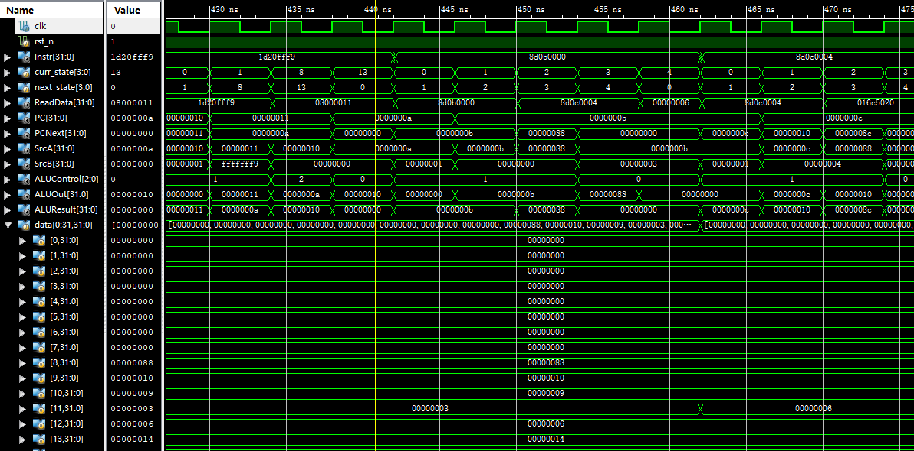
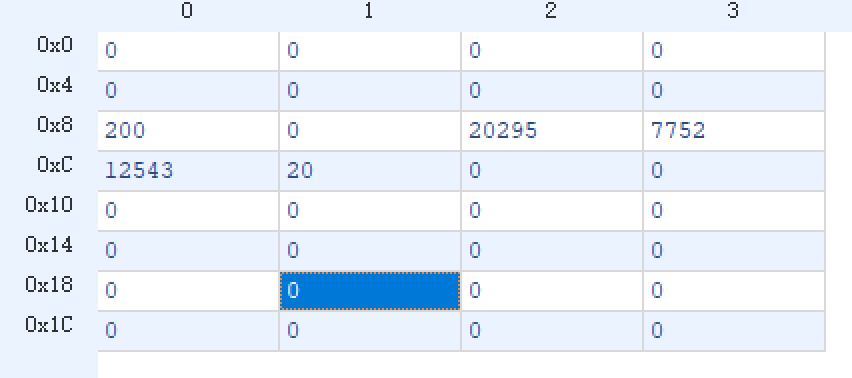

# lab06 多周期 CPU

### 张立夫 PB15020718

## 实验目的

1. 通过实验熟悉 MIPS 指令集
2. 掌握多周期 CPU 实现方式
3. 实现对给定 MIPS 指令的执行

## 实验平台

- 操作系统：Windows 10
- 编译环境：Xilinx ISE 14.7
- 仿真：ISim
- 指令编译环境：Mars 4.5

## 实验要求

1. 设计CPU，完成所给程序代码的执行，其功能是起始数为3和3的斐波拉契数列的计算。只计算20个数
2. 需要例化**一个**mem，代码段和数据段首地址自行指定
3. 实验设计中可以不使用给定的数据通路和状态机，但仅允许使用一个存储器
4. 对指令/数据存储器的附加要求：

   - 使用异步ram，最高评分为√√
   - 使用同步ram，最高评分为√√√，使用同步ram时，需要对数据通路和状态机进行适当修改
5. 涉及到的指令：
   - addi
   - add
   - lw
   - sw
   - bgtz
   - j

需实现程序：

```asm
 .data
fibs: .word   0 : 20        # "array" of  20 words to contain fib values
size: .word  20             # size of "array" 
temp: .word 3 3
      .text
      la   $t0, fibs        # load address of array
      la   $t5, size        # load address of size variable
      lw   $t5, 0($t5)      # load array size
      la   $t3, temp	    # load 
      lw   $t3, 0($t3)
      la   $t4, temp
      lw   $t4, 4($t4)

      sw   $t3, 0($t0)      # F[0] = $t3
      sw   $t4, 4($t0)      # F[1] = $t4
      addi $t1, $t5, -2     # Counter for loop, will execute (size-2) times
loop: lw   $t3, 0($t0)      # Get value from array F[n] 
      lw   $t4, 4($t0)      # Get value from array F[n+1]
      add  $t2, $t3, $t4    # $t2 = F[n] + F[n+1]
      sw   $t2, 8($t0)      # Store F[n+2] = F[n] + F[n+1] in array
      addi $t0, $t0, 4      # increment address of Fib. number source
      addi $t1, $t1, -1     # decrement loop counter
      bgtz $t1, loop        # repeat if not finished yet.
out:  
	  j out
```

## 实验过程

### 指令编译

1. 编译导出十六位指令
   - 将上述程序导入 Mars
   - 对其进行部署
   - 导出为十六进制
2. 对导出的代码进行修改
   - 将部分地址段进行修改以实现对数据段的正确访问
3. 生成 coe 文件
   - `Mem.coe`：前 18 位存放指令，第 19 位到第 52 位留空（设为 0 ），其中第 33 位到第 54 位存放计算结果，第 55 位设为 0x14（数组长度），56、 57 位设为 0x3（初始数据），采用十六进制

   - 将需要修改的指令分别去掉第四位的 '2'，再加上 '80'，即如下：

     ```
     20080080,
     200d00d0,
     8dad0000,
     200b00d4,
     8d6b0000,
     200c00d4,
     ```

   - 源码见附录

### 编写 CPU

1. 创建 `Ram`：

   - 创建两个 Ram，分别为同步 Ram2 和异步 Ram
   - 选择 Single Port
   - 大小设定为 64 * 32 bits
   - 初始化文件分选择 `Mem.coe` 

2. 创建控制模块 `Control.v`：

   - 输入时钟控制信号 `clk` 和复位信号 `rst_n` 

   - 输入为 `Instr[31:26]` 作为操作数 `op` 和 `Instr[5:0]` 作为 `funct`
   - 输出控制信号如下：
     - `MemtoReg` 控制从 Mem 读取数据写回 Reg
     - `MemWrite` 控制向 Mem 写入数据
     - `IorD` 控制输入 Mem 的是 PC 地址或数据地址
     - `Branch` 控制分支跳转
     - `IRWrite` 控制指令写入执行
     - `PCWrite` 控制对 PC 寄存器的更新
     - `RegWrite` 控制向 Reg 中写入数据
     - `ALUSrcA` 控制 ALU 第一个操作数来源选择 Reg 或 PC
       - `ALUSrcA == 1` 选择 Reg
       - `ALUSrcA == 0` 选择 PC
     - `[1:0] ALUSrcB` 控制 ALU 第二个操作数来源
       - `ALUSrcB == 00` 选择 Reg
       - `ALUSrcB == 01` 选择常数 4
       - `ALUSrcB == 10` 选择符号位扩展后的立即数
       - `ALUSrcB == 11` 选择左移两位后的立即数 （在本实验中，考虑到地址间隔为一，所以无需左移，即仍为原立即数）
     - `[1:0] PCSrc` 控制下一个 PC 
       - `PCSrc == 00` 即为当前 PC + 4
       - `PCSrc == 01` 选择分支地址
       - `PCSrc == 10` 选择跳转指令地址
     - `RegDst` 控制 Reg 写地址选择 rd 或是 rt
       - `RegDst == 1` 选择 rd
       - `RegDst == 0` 选择 rt
     - `[2:0] ALUControl` ALU 控制信号
       - `ALUControl == 1` ALU 进行加法运算
       - `ALUControl == 2` ALU 进行减法运算
       - `ALUControl == 0` 默认输出 0
   - 利用三段式有限状态机，对各个状态下进行控制信号的赋值，状态机如下图：

   

   - 对与异步 Ram，采用上图信号控制即可，对于同步 Ram，需进行如下更改：
     - 增添状态 S12，S13，S14
     - 在状态 S5 之后放置状态 S12，以提供时间对 Ram 写入
     - 在状态 S8 之后放置状态 S13
     - 在状态 S11 之后放置状态 S14
     - 上述状态均无需进行特殊控制信号的更改，仅增加周期以供 Ram 读写 
   - 本实验中各指令对应 `op` 与 `funct` 位如下：

   |            | `add` | `addi` | `lw`  | `sw`  | `bgtz` | `j`  |
   | :--------: | :---: | :----: | :---: | :---: | :----: | :--: |
   |  op[6:0]   | 6'h0  |  6'h8  | 6'h23 | 6'h2b |  6'h7  | 6'h2 |
   | funct[6:0] | 6'h20 |  N/A   |  N/A  |  N/A  |  N/A   | N/A  |

   - 状态机默认在改变状态时信号置零，选择特定有改变的信号进行赋值，具体实现见附录源代码
   - 复位时与 S0 状态相同

3. 下述模块无特殊说明即为在同步 Ram 下的实现

4. `RegFile.v`：

   - 具有两个异步读端口，一个同步写端口
   - 在 `rst_n` 信号为低电平时将所有寄存器初始化为 0

5. `ALU.v`：

   - 增加一个信号输出端口 `Zero` 
   - 当 `alu_out > 0` 时 `Zero` 为 1，以实现 `bgtz` 的分支跳转
   - `alu_op` 即为 `ALUControl` 

6. 实现 PC ：

   - 由三个模块实现
   - `pcc.v`：为 PC 寄存器，输入时钟信号 `clk` ，当其为上升沿且 `PCEn` 为 1 时输出其中保存的下一个 PC
   - `PC_MUX.v`：选择提供给 Ram 的地址是指令地址或是数据地址
   - `PC_JMUX.v`：根据控制信号 `PCSrc` 选择进行 PC + 4 `PCNext = ALUResult`（在本实验中，由于内存中数据间隔为 1，所以实际为 PC + 1）；或是执行分支操作 `PCNext = ALUOut` ；或执行跳转操作，跳转即将 `Instr[25:0]` 赋值给 `PCNext` 即可

7. 实现符号位扩展模块 `Ext.v`：

   - 输出 [15:0] 位即为立即数的 [15:0] 位
   - 输出 [31:16] 位根据立即数第 15 位进行补全：
     - 当其为 1 时，补全为 `16'hffff`
     - 当其为 0 时，补全为 `16'h0000`

8. 实现各个控制信号多选器：

   - `SrcB_MUX.v`：由 `ALUSrcB` 控制选择立即数或是 Reg 或是常数 4（本实验中为 1）
   - `MUX.v`：32 位输入输出多选器，例化为：`MAMUX`，`PAMUX` 
   - `RD_MUX.v`：由 `RegDst` 控制选择 rd 或者 rt 作为 Reg 的输入

9. 其他模块：

   - 时钟寄存器 `CLK_EN.v`：例化为 `RD1`, `RD2`, `ALUEN` ，在时钟上升沿输出改变为当前输入
   - 非时钟寄存器 `IR.v`：与异步 Ram 实现所不同之处，即在控制信号 `IRWrite` 为 1 时，保持指令 `Instr` 等于从 Ram 中读取数据 `ReadData`，即无需等待一个时钟周期

10. 创建 `top.v` （异步 Ram 顶层文件）：

    - 提供时钟信号 clk 和复位信号 rst_n 的输入

    - 调用上述各种模块，由 `Control.v` 模块产生控制信号

    - 例化一个内存模块：`Mem` 

    - 其中包含两个逻辑门得到两个控制信号：

      ```verilog
      assign ZBAnd = Branch & Zero;
      assign PCEn = ZBAnd | PCWrite;
      ```

    - 电路构成与下图基本相符（除去 PCSrc 控制多选器）

      

11. 创建 `top2.v` （同步 Ram 顶层文件）：

    - 除电路外与异步实现相同
    - 电路部分有以下修改：
      - 对于 `PC` 的时钟控制寄存器，改为初始化输出值为 -1，为在仿真时避免跳过第一条指令
      - 取消 `Data` 前的时钟控制寄存器，使从 Ram 中读取的数据直接到达下一个多选器
      - 取消 `Instr` 前的时钟控制寄存器的时钟信号，即使能改变时，立即改变输出信号

## 实验结果

**因 `Control.v` 已为同步 Ram 修改，故以下仅为同步 Ram 情况下的仿真结果**

1. `top2.v` 仿真：

   

   - 初始状态
   - `data[0:31,31:0]` 为寄存器

   

   - 执行过程中

   

   - 最终进入 `out` 循环

2. 内存与寄存器中数

   - `Mem` 初始化值

   

   - 执行过程中的值

   

   - 执行结束后的值（十六进制）

   

   - 执行结束后的值（十进制）

   

   - 执行结束后寄存器中的值

## 实验总结

本次实验进一步熟悉了 MIPS 三种类型指令再多周期 CPU 下的执行过程，成功仿真了多周期的 CPU 的工作，并根据同步与异步两种类型的 Ram 实现了两种 CPU，且均达到实验要求。

## 附录

### 源代码：

`top2.v` :

```verilog
`timescale 1ns / 1ps

module top2(
    input clk,
    input rst_n
);

wire [31:0] Instr, Data, ReadData, RD, RegOutA, RegOutB, RegIn, RegOut1, RegOut2, SignImm, SrcA, SrcB, ALUResult, ALUOut, PC, PCNext;
wire [5:0] Adr;
wire [4:0] WriteReg;
wire [2:0] ALUControl;
wire [1:0] PCSrc, ALUSrcB;
wire PCWrite, Branch, ALUSrcA, RegWrite, RegDst, Zero, MemtoReg, MemWrite, IRWrite, IorD, PCEn, ZBAnd;

assign ZBAnd = Branch & Zero;
assign PCEn = ZBAnd | PCWrite;

Control Con(clk, rst_n, Instr[31:26], Instr[5:0], MemtoReg, RegDst, IorD, PCSrc, ALUSrcA, ALUSrcB, IRWrite, MemWrite, PCWrite, Branch, RegWrite, ALUControl);

Ram2 Mem(
    .addra(Adr),
    .clka(clk),
    .wea(MemWrite),
    .dina(RegOutB),
    .douta(ReadData)
);

RegFile Reg(clk, rst_n, RegWrite, Instr[25:21], Instr[20:16], WriteReg, RegIn, RegOut1, RegOut2);

Ext E(Instr[15:0], SignImm);

ALU alu(SrcA, SrcB, ALUControl, Zero, ALUResult);

SrcB_MUX SBMUX(ALUSrcB, RegOutB, SignImm, SrcB);
MUX MA_MUX(MemtoReg, ReadData, ALUOut, RegIn);
MUX PA_MUX(ALUSrcA, RegOutA, PC, SrcA);
RD_MUX RDMUX(RegDst, Instr[20:16], Instr[15:11], WriteReg);
PC_MUX PCMUX(IorD, PC, ALUOut, Adr);
PC_JMUX PCJMUX(PCSrc, ALUResult, ALUOut, Instr[27:0], PC[31:28], PCNext);

pcc PCEN(clk, PCEn, PCNext, PC);
IR InsEN(IRWrite, ReadData, Instr);
CLK_EN RD1(clk, 1, RegOut1, RegOutA);
CLK_EN RD2(clk, 1, RegOut2, RegOutB);
CLK_EN ALUEN(clk, 1, ALUResult, ALUOut);

endmodule
```

`top.v` :

```verilog
`timescale 1ns / 1ps

module top(
    input clk,
    input rst_n
);

wire [31:0] Instr, Data, ReadData, RD, RegOutA, RegOutB, RegIn, RegOut1, RegOut2, SignImm, SrcA, SrcB, ALUResult, ALUOut, PC, PCNext;
wire [5:0] Adr;
wire [4:0] WriteReg;
wire [2:0] ALUControl;
wire [1:0] PCSrc, ALUSrcB;
wire PCWrite, Branch, ALUSrcA, RegWrite, RegDst, Zero, MemtoReg, MemWrite, IRWrite, IorD, PCEn, ZBAnd;

assign ZBAnd = Branch & Zero;
assign PCEn = ZBAnd | PCWrite;

Control Con(clk, rst_n, Instr[31:26], Instr[5:0], MemtoReg, RegDst, IorD, PCSrc, ALUSrcA, ALUSrcB, IRWrite, MemWrite, PCWrite, Branch, RegWrite, ALUControl);

Ram Mem(
    .a(Adr),
    .clk(clk),
    .we(MemWrite),
    .d(RegOutB),
    .spo(ReadData)
);

RegFile Reg(clk, rst_n, RegWrite, Instr[25:21], Instr[20:16], WriteReg, RegIn, RegOut1, RegOut2);

Ext E(Instr[15:0], SignImm);

ALU alu(SrcA, SrcB, ALUControl, Zero, ALUResult);

SrcB_MUX SBMUX(ALUSrcB, RegOutB, SignImm, SrcB);
MUX MA_MUX(MemtoReg, Data, ALUOut, RegIn);
MUX PA_MUX(ALUSrcA, RegOutA, PC, SrcA);
RD_MUX RDMUX(RegDst, Instr[20:16], Instr[15:11], WriteReg);
PC_MUX PCMUX(IorD, PC, ALUOut, Adr);
PC_JMUX PCJMUX(PCSrc, ALUResult, ALUOut, Instr[27:0], PC[31:28], PCNext);

CLK_EN PCEN(clk, PCEn, PCNext, PC);
CLK_EN InsEN(clk, IRWrite, ReadData, Instr);
CLK_EN DataEN(clk, 1, ReadData, Data);
CLK_EN RD1(clk, 1, RegOut1, RegOutA);
CLK_EN RD2(clk, 1, RegOut2, RegOutB);
CLK_EN ALUEN(clk, 1, ALUResult, ALUOut);

endmodule
```

`Control.v` :

```verilog
`timescale 1ns / 1ps

module Control(
    input clk,
    input rst_n,
    input [5:0] op,
    input [5:0] funct,
    output reg MemtoReg,
    output reg RegDst,
    output reg IorD,
    output reg [1:0] PCSrc,
    output reg ALUSrcA,
    output reg [1:0] ALUSrcB,
    output reg IRWrite,
    output reg MemWrite,
    output reg PCWrite,
    output reg Branch,
    output reg RegWrite,
    output reg [2:0] ALUControl
);

parameter S0 = 4'd0;
parameter S1 = 4'd1;
parameter S2 = 4'd2;
parameter S3 = 4'd3;
parameter S4 = 4'd4;
parameter S5 = 4'd5;
parameter S6 = 4'd6;
parameter S7 = 4'd7;
parameter S8 = 4'd8;
parameter S9 = 4'd9;
parameter S10 = 4'd10;
parameter S11 = 4'd11;
parameter S12 = 4'd12;
parameter S13 = 4'd13;
parameter S14 = 4'd14;

reg [3:0] curr_state, next_state;

always@(posedge clk or negedge rst_n) begin
    if (~rst_n)
        curr_state <= S0;
    else
        curr_state <= next_state;
end

always@(*) begin
    case(curr_state)
        S0:
		    next_state = S1;
        S1:
            if (op == 6'h23 || op == 6'h2b)
                next_state = S2;
            else if (op == 6'h0) 
                next_state = S6;
            else if (op == 6'h7)
                next_state = S8;
            else if (op == 6'h8)
                next_state = S9;
            else if (op == 6'h2)
                next_state = S11;
            else
                next_state = S0;
        S2:
            if (op == 6'h23)
                next_state = S3;
            else
                next_state = S5;
        S3:
            next_state = S4;
		S5:
			next_state = S12;
        S6:
            next_state = S7;
		S8:
		    next_state = S13;
        S9:
            next_state = S10;
		S11:
			next_state = S14;
        default:
            next_state = S0;
    endcase
end

always@(posedge clk or negedge rst_n) begin
    if (~rst_n || next_state == S0) begin
        IorD <= 0;
        ALUSrcA <= 0;
        ALUSrcB <= 2'b01;
        ALUControl <= 3'b001;
        PCSrc <= 0;
        IRWrite <= 1;
        MemWrite <= 0;
        PCWrite <= 1;
        Branch <= 0;
        RegWrite <= 0;
        MemtoReg <= 0;
        RegDst <= 0;
    end
    else begin
        IorD <= 0;
        ALUSrcA <= 0;
        ALUSrcB <= 0;
        PCSrc <= 0;
        IRWrite <= 0;
        MemtoReg <= 0;
        MemWrite <= 0;
        PCWrite <= 0;
        Branch <= 0;
        RegWrite <= 0;
        RegDst <= 0;
        ALUControl <= 0;
        if (next_state == S1) begin
            ALUSrcA <= 0;
            ALUSrcB <= 2'b11;
            ALUControl <= 3'b001;
        end
        else if (next_state == S2) begin
            ALUSrcA <= 1;
            ALUSrcB <= 2'b10;
            ALUControl <= 3'b001;
        end
        else if (next_state == S3) 
            IorD <= 1;
        else if (next_state == S4) begin
            RegDst <= 0;
            MemtoReg <= 1;
            RegWrite <= 1;
        end
        else if (next_state == S5) begin
            IorD <= 1;
            MemWrite <= 1;
        end
        else if (next_state == S6) begin
            ALUSrcA <= 1;
            ALUSrcB <= 2'b00;
            ALUControl <= 3'b001;
        end
        else if (next_state == S7) begin
            RegDst <= 1;
            MemtoReg <= 0;
            RegWrite <= 1;
        end
        else if (next_state == S8) begin
            ALUSrcA <= 1;
            ALUSrcB <= 0;
            ALUControl <= 3'b010;
            PCSrc <= 2'b01;
            Branch <= 1;
        end
        else if (next_state == S9) begin
            ALUSrcA <= 1;
            ALUSrcB <= 2'b10;
            ALUControl <= 3'b001;
        end
        else if (next_state == S10) begin
            RegDst <= 0;
            MemtoReg <= 0;
            RegWrite <= 1;
        end
        else if (next_state == S11) begin
            PCSrc <= 2'b10;
            PCWrite <= 1;
        end
    end
end

endmodule
```

`RegFile.v` :

```verilog
`timescale 1ns / 1ps

module RegFile(
	input 			clk,
	input 			rst_n,
	input			RegWrite,
	input 	[4:0] 	rAddr0,
	input	[4:0]	rAddr1,
	input 	[4:0] 	wAddr,
	input 	[31:0] 	wDin,
	output	[31:0] 	rDout0,
	output	[31:0]  rDout1
);

reg [31:0] data [0:31];
integer i;

assign rDout0 = data[rAddr0];
assign rDout1 = data[rAddr1];

always@(posedge clk or negedge rst_n) begin
	if(~rst_n) begin
		for(i = 0; i < 32; i = i + 1)
			data[i] <= 0;	
	end
	else if(RegWrite)
		data[wAddr] <= wDin;
end

endmodule
```

`ALU.v` :

```verilog
`timescale 1ns / 1ps

module ALU(
    input signed [31:0] alu_a,
    input signed [31:0] alu_b,
    input        [2:0]  alu_op,
    output reg Zero,
    output reg signed [31:0] alu_out
);

parameter A_NOP = 2'h00;  //空运�
parameter	A_ADD = 2'h01;	//符号�
parameter	A_SUB = 2'h02;	//符号�
parameter	A_AND = 2'h03;	//�
parameter	A_OR = 2'h04;	//�
parameter	A_XOR = 2'h05;	//异或
parameter	A_NOR = 2'h06;	//或非

always@(*) begin
  case (alu_op)
    A_NOP: alu_out = 32'h0;
    A_ADD: alu_out = alu_a + alu_b;
    A_SUB: alu_out = alu_a - alu_b;
    A_AND: alu_out = alu_a & alu_b;
    A_OR: alu_out = alu_a | alu_b;
    A_XOR: alu_out = alu_a ^ alu_b;
    A_NOR: alu_out = ~(alu_a | alu_b);
    default: alu_out = alu_a;
  endcase
  if (alu_out > 0)
    Zero = 1;
  else
    Zero = 0;
end

endmodule
```

`CLK_EN.v` :

```verilog
`timescale 1ns / 1ps

module CLK_EN(
    input clk,
    input EN,
    input [31:0] din,
    output reg [31:0] dout
);

initial begin
dout = 0;
end

always@(posedge clk) begin
    if (EN)
        dout <= din;
    else
        dout <= dout;
end

endmodule
```

`Ext.v` :

```verilog
`timescale 1ns / 1ps

module Ext(
    input [15:0] imm_in,
    output [31:0] imm_out
);

assign imm_out[15:0] = imm_in;
assign imm_out[31:16] = imm_in[15]? 16'hffff: 16'h0000;

endmodule
```

`IR.v` :

```verilog
`timescale 1ns / 1ps

module IR(
	input IRWrite,
	input [31:0] a,
	output reg [31:0] b
    );

always@(*)
	if (IRWrite)
		b = a;

endmodule
```

`MUX.v` :

```verilog
`timescale 1ns / 1ps

module MUX(
    input En,
    input [31:0] In1,
    input [31:0] In2,
    output [31:0] Out
);

assign Out = En? In1: In2;

endmodule
```

`PC_JMUX.v` :

```verilog
`timescale 1ns / 1ps

module PC_JMUX(
    input [1:0] PCSrc,
    input [31:0] ALUResult,
    input [31:0] ALUOut,
    input [27:0] Ins,
    input [3:0] PC,
    output reg [31:0] PCNext
);

always@(*) begin
    if (PCSrc == 2'b00)
        PCNext = ALUResult;
    else if (PCSrc == 2'b01)
        PCNext = ALUOut;
    else if (PCSrc == 2'b10) begin
        PCNext[25:0] = Ins[25:0];
        PCNext[31:28] = PC;
    end
end

endmodule
```

`PC_MUX.v` :

```verilog
`timescale 1ns / 1ps

module PC_MUX(
    input IorD,
    input [31:0] PC,
    input [31:0] Data,
    output reg [5:0] Addr
);

always@(*) begin
    if (IorD)
        Addr = Data[7:0] >> 2;
    else
        Addr = PC[5:0];
end

endmodule
```

`pcc.v` :

```verilog
`timescale 1ns / 1ps

module pcc(
    input clk,
    input EN,
    input [31:0] din,
    output reg [31:0] dout
);

initial begin
dout = -1;
end

always@(posedge clk) begin
    if (EN)
        dout <= din;
    else
        dout <= dout;
end

endmodule
```

`RD_MUX.v` :

```verilog
`timescale 1ns / 1ps

module RD_MUX(
    input RegDst,
    input [4:0] ins0,
    input [4:0] ins1,
    output [4:0] WriteReg
);

assign WriteReg = RegDst? ins1: ins0;

endmodule
```

`SrcB_MUX.v` :

```verilog
`timescale 1ns / 1ps

module SrcB_MUX(
    input [1:0] ALUSrcB,
    input [31:0] RegData,
    input [31:0] ImmData,
    output reg [31:0] SrcB
);

always@(ALUSrcB) begin
    case(ALUSrcB)
        2'b00:
            SrcB = RegData;
        2'b01:
            SrcB = 32'd1;
        default:
            SrcB = ImmData;
    endcase
end

endmodule
```

`t.v` 对应 `top2.v` 

```verilog
`timescale 1ns / 1ps

module t;

	// Inputs
	reg clk;
	reg rst_n;

	// Instantiate the Unit Under Test (UUT)
	top2 uut (
		.clk(clk), 
		.rst_n(rst_n)
	);
	always #2 clk = ~clk;
	initial begin
		// Initialize Inputs
		clk = 0;
		rst_n = 0;

		// Wait 100 ns for global reset to finish
		#1;
		rst_n = 1;
        
		// Add stimulus here

	end
      
endmodule
```

`test.v` 对应 `top.v` :

```verilog
`timescale 1ns / 1ps

module test;

	// Inputs
	reg clk;
	reg rst_n;

	// Instantiate the Unit Under Test (UUT)
	top uut (
		.clk(clk), 
		.rst_n(rst_n)
	);
	always #2 clk = ~clk;
	initial begin
		// Initialize Inputs
		clk = 0;
		rst_n = 0;

		// Wait 100 ns for global reset to finish
		#1;
		rst_n = 1;
        
		// Add stimulus here

	end
      
endmodule
```

